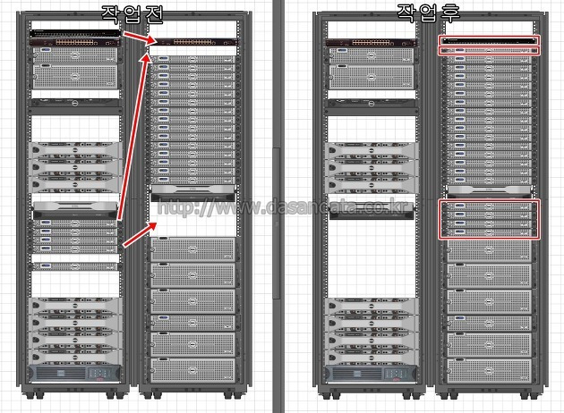
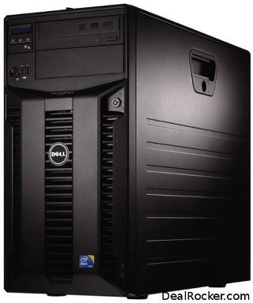
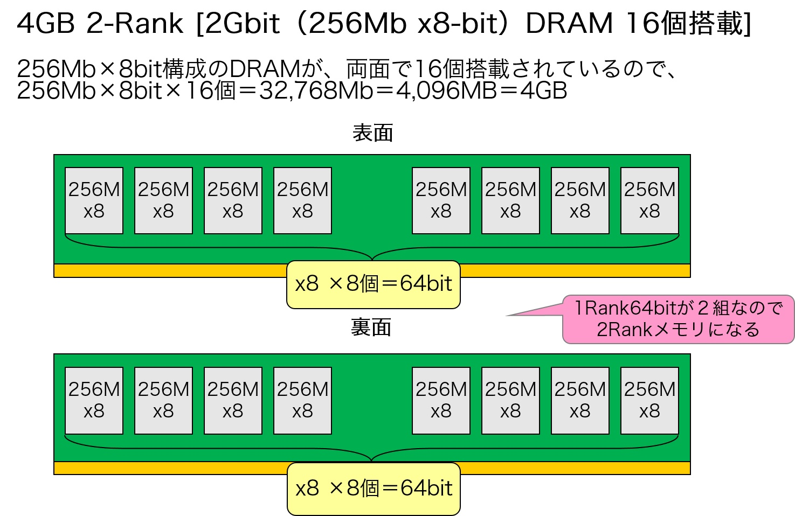
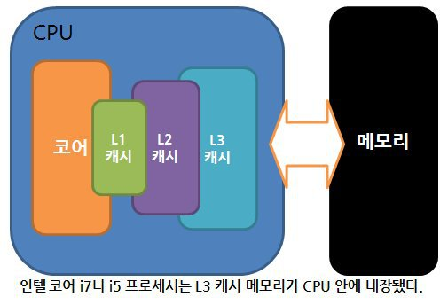
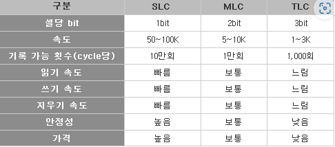
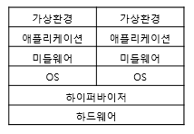

    

## 목차 (Table of Contents)

1. [서버](#서버)
   - [서버 종류](#서버-종류)
   - [서버 선정](#서버-선정)
2. [메모리](#메모리)
3. [CPU](#cpu)
4. [디스크의 종류](#디스크의-종류)
5. [RAID](#raid)
6. [가상화](#가상화)
7. [네트워크 장비 선택](#네트워크-장비-선택)
8. [네트워크의 토폴로지](#네트워크의-토폴로지)
9. [네트워크의 기본 용어 요점 정리](#네트워크의-기본-용어-요점-정리)
10. [네트워크의 케이블](#네트워크의-케이블)
11. [스토리지](#스토리지)

---

## 서버

### 서버 종류

#### 랙 마운트 서버

**랙이란?**
서버 또는 네트워크 장비들을 넣어두는 **철체 프레임**이다. 데이터센터나 서버 룸과 같이 다수의 서버/네트워크 장비들을 두는 곳에서 사용한다.

**랙을 사용하는 이유**
서버 또는 네트워크 장비들을 구성할 때, 작은 공간을 효율적으로 사용하고 장비들을 안정적으로 보호하기 위해 사용된다.

**랙을 사용할 때 고려해야 하는 상황**
- 사용할 랙 마운트 구성의 선택은 처리 능력, 스토리지 용량 및 데이터 센터 내의 물리적 공간 가용성 측면에서 특정 요구 사항에 따라 달라집니다.
- 유닛(1.75 Inch)이 늘어날 때마다 공간과 발열 관리의 부담이 늘어나지만, 장점으로는 많은 메모리, 충분한 스토리지를 확보할 수 있다.
- 필요한 계산 규모에 따라 유닛의 개수를 고려하여 설계한다.

#### 타워형 서버

타워형 서버는 일반적으로 데이터 센터 입주용으로는 잘 사용되지 않는데 입주 비용(쉽게 말해 '월세')이 비싸기 때문이다. 

**특징:**
- 대부분 타워형 서버는 4U 서버나 5U 랙서버에 해당하는 상면 비용을 받는다
- 1U 서버에 비해 4배 이상 비싼 임대료를 내야 한다
- 워크스테이션 겸용 플랫폼인 경우가 많아 소음이 작고 확장성이 우수
- 보통 사무실에 두고 쓰는 소규모 인원으로 관리되는 서버로 인기가 많다

#### 엔트리, 미들레인지, 하이엔드 서버

서버는 용도에 따라 **엔트리, 미드레인지, 하이엔드** 서버를 구분해서 사용한다.

| 서버 유형 | 특징 | 주요 용도 | 소켓 수 |
|----------|------|-----------|---------|
| **엔트리 서버** | 전력소모와 발열, 소음이 가장 낮음 | 웹 서버, 애플리케이션 서버 | 1~2개 CPU |
| **미들레인지 서버** | 수천만 원대, 기간계 시스템 사용 | 데이터베이스 서버, 기간계 서버 | 4개 이상 CPU |
| **하이엔드 서버** | 수억 원대, 최고 성능 | 데이터베이스 서버, 기간계 서버 | 수십 개 이상 CPU |

> **기간계 시스템이란?** 기간 업무 시스템이라고도 불리며, 기업 경영을 지속하는데 핵심이 되는 재무관리, 업무관리, 생산관리 등을 담당하는 시스템이다.

#### IA 서버

인텔이나 AMD 등 인텔 호환 CPU를 탑재하고, 일반 컴퓨터와 같은 아키텍처를 기반으로 만들어진 서버이다.

**IA 서버 선택 시 고려사항:**
1. 데이터센터의 랙에 서버가 제대로 장착되는가?
2. 설치할 수 있는 부품수 (하드디스크, 메모리 등)
3. 장애 발생시 지원 체계
4. 원격 제어 기능
5. 납기

#### 엔터프라이즈 서버

엔터프라이즈 서버는 기본적으로 모두 비싸다.

**특징:**
- 액세스가 대량으로 일어나도 견딜 수 있도록 수용량이 크고 내구성이 높음
- IA 서버와는 달리 고가라 보통은 다룰 기회가 거의 없음

### 서버 선정

#### 서버의 조건

서버의 사양을 결정할 때 필요한 하드웨어 자원의 사용량을 정하고 나서 CPU, 메모리, 디스크, NIC 포트 수 등을 결정한다.

#### 서버 사양의 결정 방법

1. **실제 환경 시험 구축**
   - 기간계라고 불리는 시스템의 중핵을 담당하는 시스템이나 중요한 시스템일 때 권장
   - 많은 노력과 시간이 필요

2. **현장 투입 후 측정**
   - 온라인 게임처럼 실제로 공개해보지 않아서 액세스 양이 정해지지 않았을 경우 권장
   - 실제 하드웨어 자원의 이용 상황을 측정한 다음, 서버와 서버의 부품을 늘리거나 줄임

3. **소거법으로 사양 좁히기**
   - 웹 서버의 경우 메모리 이외의 하드웨어 리소스는 그다지 소비되지 않음
   - 메모리만 넉넉하게 설치 후 나머지는 필요한 최소한의 사양으로 결정

#### 스케일 아웃, 스케일 업

서버의 용량을 늘리는 방법이다.

| 방법 | 설명 |
|------|------|
| **스케일 아웃** | 성능이 부족하면, 서버의 수를 늘려서 수용량을 늘리는 방법 |
| **스케일 업** | 성능이 부족해지면 메모리 증설 등 부품을 추가/업그레이드하여 서버의 성능을 높이는 방법 |

---

## 메모리

메모리는 단기 기억 영역이라 불리며, 일시적으로 데이터를 기억할 수 있지만 휘발성 메모리와 비휘발성 메모리로 분류된다.

**중요 요소:** 메모리 용량, 내장애성, 성능, 저전력 등이 중시된다.

### DDR SDRAM의 종류

**DDR (Double Data Raid Synchronous Dynamic Random Access Memory)**

1. **DDR3** (2007년 출시)
2. **DDR4** (2014년 출시)
   - 2015년부터 DDR4 SDRAM 가격이 빠르게 하락
   - 중저가 이하의 신형 메인보드에도 DDR4 메모리 기본 지원
3. **DDR5** (2020년 7월 표준 발표)
   - 용량과 대역폭 향상, 전압 감소
   - DIMM 하나당 64bit를 32bit 듀얼 채널로 구성
   - on-DIMM 전압 조정기 장착

### 성능

메모리의 속도는 메모리 자체의 속도와 CPU와 각종 버스 간의 데이터 전송폭을 모두 고려한다.

**예시:** DDR5-5600 램의 내부 동작 속도는 5600MHz를 의미하며, 이를 MB/s 단위로 표기하면 44800MB/s가 된다.

### 주요 메모리 유형

#### ECC 메모리

메모리의 데이터는 다양한 원인(우주방사선, 알파선, 전자기 간섭 및 하드웨어 오류 등)으로 인해 오류가 발생될 수 있다.

- **싱글비트(1비트) 오류**: 메모리 시스템에 의해 수정 가능
- **멀티비트 오류**: 메모리에 추가된 별도의 칩셋을 통해 감지 가능
- **ECC**: **E**rror **C**orrection **C**ode

#### REG 메모리

REG 메모리는 **레지스터드(Registered) 메모리**라 하여 서버용으로 사용된다.

**특징:**
- ECC 메모리와 달리 별도의 메모리 컨트롤러가 붙어 있음
- 메인보드의 메모리 컨트롤러와 직접 통신
- 하나의 메인보드에 수십 개의 메모리 장착 시 효율적 관리
- 고용량의 메모리 제작 가능

#### 채널과 랭크

- **채널**: CPU와 메인보드가 지원하는 RAM의 최대 개수에 맞게 동일한 회사와 동일한 주파수의 램 구성
- **랭크**: 1개의 DIMM에 64비트 DRAM 그룹이 1개면 싱글 랭크, 2개면 듀얼 랭크

### DIMM 유형

**DIMM**: 데스크톱 컴퓨터, 서버 및 워크스테이션에 가장 널리 사용되는 DRAM 모듈 유형

- **RDIMM**: 메모리 컨트롤러와 DRAM 모듈 사이에 추가 레지스터 포함
- **LRDIMM**: 추가 메모리 버퍼 칩을 사용하여 더 높은 용량과 향상된 성능 구현

---

## CPU

컴퓨터 시스템을 통제하고 프로그램의 연산을 실행·처리하는 가장 핵심적인 컴퓨터의 제어 장치. 사람의 두뇌에 해당한다.

### 성능과 발열, 소비 전력

CPU는 연산 능력이 높으면 높을수록 고성능 CPU로 분류한다.

**트레이드오프:**
- 단일 연산 능력이 높아질수록 소비 전력 증가
- 전력 증가 → 발열 상승
- 단일 코어 클럭 향상보다는 멀티 코어/멀티 쓰레드로 연산 능력 향상

### CPU 스펙

| 스펙 | 설명 |
|------|------|
| **소켓** | 마이크로프로세서와 PCB 사이의 기계적, 전기적 연결 제공 |
| **코어 수** | CPU의 주요 계산 부분. 물리적으로 구성된 코어의 수 |
| **스레드 수** | 물리적 코어와 논리적 코어의 스레드 수 합계 |
| **클럭** | 1초당 전기적 속도 (Hz). 높을수록 빠르지만 전력 소모와 발열 증가 |
| **캐시** | CPU 구조에 메모리로 사용하도록 구성된 하드웨어 캐시 |

#### 하이퍼 스레딩

각 코어에서 두 개 이상의 쓰레드를 사용할 수 있도록 만든 **인텔의 기술**

- 하나의 프로세서 처리 시 프로세서 리소스를 각 쓰레드별로 할당하여 병렬 처리

#### 터보 부스트 기술, 프리시전 부스트

작업에서 할당된 코어가 한 개일 때, CPU의 클럭을 가변적으로 늘려 작업 속도를 향상시키는 기술

- **인텔**: 터보 부스트
- **AMD**: 프리시전 부스트

### CPU 선정 포인트

1. **성능**: 요구하는 연산 능력을 만족하는가?
2. **가격**: 요구하는 스펙에 가격이 타당한가?
3. **소프트웨어 라이선스 체계**: CPU 코어 수와 소켓 수로 가격이 달라지는 소프트웨어 고려
4. **소비 전력**: 저전력 CPU로 장기적 유지 비용 절감 가능

---

## 디스크의 종류

### SATA 하드 디스크
- **장점**: 가격이 저렴
- **용도**: 하루 8시간 정도의 가동
- **단점**: SAS보다 내장애성이 낮음

### SAS 하드 디스크
- **장점**: 고속 동작, 신뢰성 높음
- **용도**: 24시간 365일 가동

### FC 하드 디스크
- **장점**: 초고속 동작, 신뢰성 높음
- **용도**: SAN 스토리지 등 엔터프라이즈

### 니어 라인 하드 디스크
- **정의**: 온라인과 오프라인의 중간 상태
- **용도**: 아카이브의 장기 보존, 하루 몇 시간 정도 이용
- **종류**: NL-SATA, NL-SAS

### SSD

반도체 소자 메모리를 기억 장치에 이용한 디스크

#### 장점
1. 데이터 대역폭이 크다
2. 데이터 접근 속도가 빠르다
3. 소비 전력과 발열이 낮다

#### 단점
1. 동일 용량 대비 하드 디스크보다 비싸다
2. 사용 기간이 길수록 저가 제품일수록 성능이 떨어진다

#### SSD 종류

- **SATA SSD**: 최대 550 MB/s 처리 속도
- **mSATA SSD**: mini-SATA 인터페이스

#### SSD 메모리 셀 종류

| 타입 | 내구성 | 특징 |
|------|--------|------|
| **SLC** | 0~100K Endurance Cycle | 빠른 속도, 높은 안정성, 고가 |
| **MLC** | 5~10K Endurance Cycle | 적당한 성능, 합리적 가격 |
| **TLC** | 1~3K Endurance Cycle | 느린 속도, 고용량, 저가 |

### 엔터프라이즈 플래시 메모리 스토리지

엔터프라이즈 용도로 비휘발성 메모리가 사용된다. SSD는 SATA 인터페이스로 연결하지만, PCI-E로 연결되는 경우가 많다.

---

## RAID

RAID는 여러 개의 디스크를 묶어 하나의 디스크처럼 사용하는 기술입니다.

### RAID 레벨

| RAID 레벨 | 특징 | 용도 |
|----------|------|------|
| **RAID 0** | 모든 디스크에 데이터 분할 저장, 내장애성 낮음 | 성능 우선 |
| **RAID 1** | 미러링, 높은 내장애성 | 운영체제 파티션 |
| **RAID 5** | 패리티 1개, 용량과 성능 균형 | 파일 서버, 로그 저장 |
| **RAID 6** | 패리티 2개, RAID 5보다 안정성 높음 | 안정성 우선 |
| **RAID 10** | RAID 0 + RAID 1 조합 | 고성능 + 안정성 |

> **RAID 2, 3, 4**: 현재는 거의 사용하지 않는 RAID 레벨

---

## 가상화

한 대의 물리 서버에서 여러 개의 운영체제를 가동할 수 있는 기술

### 물리 서버 vs 가상 서버

| 구분 | 물리 서버 | 가상 서버 |
|------|-----------|-----------|
| **적합한 용도** | CPU 사용률, 디스크 I/O 부하가 많은 용도 | CPU 사용률, 디스크 I/O 부하가 적은 용도 |
| **주요 사용처** | 데이터베이스 서버, 애플리케이션 서버 | 웹 서버, 개발 서버, 메모리 DB |

### 가상화의 장단점

#### 장점
1. 비용 절감
2. 게스트 운영체제의 하드웨어 자원을 쉽게 조정 가능
3. 물리 서버 교체 시 게스트 운영체제를 쉽게 이전 가능

#### 단점
1. 다른 게스트 운영체제의 자원 사용량에 따라 성능 영향
2. 사용하지 않는 게스트 운영체제 관리 문제

### 가상화 모델

#### 호스트 운영체제 타입

- **장점**: 일반 운영체제에서 게스트 운영체제 운용으로 제약이 적음
- **단점**: OS 위에 OS가 얹히는 방식으로 오버헤드가 클 수 있음

#### 하이퍼바이저 타입

- **장점**: 별도의 호스트 운영체제가 없어 오버헤드가 적고 효율적
- **단점**: 관리를 위한 별도 컴퓨터나 콘솔 필요

### 가상화 솔루션

- **VMware vSphere**: 하이퍼바이저, 업계 최고 수준의 안정성과 편리성
- **Hyper-V (Windows Server 2012)**: 마이크로소프트 가상화 솔루션
- **Hyper-V Server 2012**: 무료 버전
- **Xen**: 리눅스 커널 3계열에 병합
- **KVM**: 리눅스 커널 표준 기능 (2007년)

### 가상화 환경 선택 방법

- **VMware vs Hyper-V**: 윈도우+리눅스 혼재 환경은 VMware, 윈도우 중심 환경은 Hyper-V
- **Xen vs KVM**: 리눅스 중심 환경에서 초기 비용 절약 시, 레드햇 환경은 KVM 권장

---

## 네트워크 장비 선택

### 라우터

#### 라우터의 역할
라우터는 수신한 패킷을 적절한 경로로 전송하는 네트워크 장비다. 네트워크를 논리적으로 나누는 장비이기도 하다.

#### 라우팅 방식

| 방식 | 특징 | 장점 | 단점 |
|------|------|------|------|
| **정적 라우팅** | 관리자가 직접 경로 지정 | 빠르고 안정적, 라우터 부담 적음 | 네트워크 변화 시 설정 변경 어려움 |
| **동적 라우팅** | 라우터 간 자동 정보 교환 | 자동 라우팅 테이블 작성 | 메모리 사용량 많음 |

#### 라우터 선택 포인트

1. **인터페이스 호환성**: ISP나 데이터센터의 상위 회선 인터페이스와 일치
2. **통신 대역**: WAN에서의 통신 대역에 따른 선택
3. **스루풋**: 단위 시간당 데이터 전송량에 따른 성능 선택
4. **보안 기능**: 대규모 환경에서는 라우팅과 보안 기능 분리 권장

### 스위치

#### L2와 L3 스위치

스위치는 허브와 달리 필요로 하는 포트로만 신호를 전달하여 불필요한 트래픽을 감소시킨다.

- **L2 스위치**: MAC 주소를 보고 적절한 포트로 프레임 전송
- **L3 스위치**: IP 주소를 보고 적절한 포트로 패킷 전송

#### L4와 L7 스위치

- **L4 스위치**: IP와 TCP/UDP 포트를 보고 적절한 서버로 패킷 전송
- **L7 스위치**: URL을 보고 적절한 서버로 전송
- **로드 밸런서**: 부하 분산 기능이 달린 L3 스위치

---

## 네트워크의 토폴로지

### 2계층 구조
- **프론트 엔드 계층**: 토폴로지적으로 인터넷에서 가까운 곳에 위치
- **백 엔드 계층**: 토폴로지적으로 인터넷에서 먼 곳에 위치

### 3계층 구조

여러 개의 서버 룸이 있는 환경에서 사용:

- **코어 계층**: 디스트리뷰션 계층에서 오는 통신을 집약해 인터넷에 연결
- **디스트리뷰션 계층**: 통신을 집약해서 코어 계층에 연결하고 액세스 계층 간 통신 중계
- **액세스 계층**: 서버에서 오는 통신을 집약해서 디스트리뷰션 층에 연결

### 네트워크 패브릭 구조

액세스 계층과 L2 네트워크를 가상화하여 물리적으로 다른 랙이나 스위치를 논리적으로 한 네트워크로 보이게 하는 기술

**장점**: 서버와 랙의 물리적 제약으로부터 해방

---

## 네트워크의 기본 용어 요점 정리

### 프로토콜과 표준

- **TCP/IP**: 인터넷에서 일반적으로 이용되는 프로토콜
- **프로토콜**: 컴퓨터 또는 전자 기기 간의 원활한 통신을 위해 지키기로 약속한 규약
- **OSI 7 Layer**: 국제 표준화 기구에서 책정된 컴퓨터 통신 기능을 계층 구조로 나눈 모델

### 전송 프로토콜

#### TCP (Transmission Control Protocol)

**특징**: 연결 지향형 프로토콜, 고품질 통신

**3웨이 핸드셰이크**:
1. 클라이언트 → 서버: SYN 패킷 전송
2. 서버 → 클라이언트: ACK + SYN 패킷 전송  
3. 클라이언트 → 서버: ACK 패킷 전송, 연결 성립

#### UDP (User Datagram Protocol)

**특징**: 비연결형 프로토콜, 저품질이지만 고속

### IP 주소 체계

- **IPv4**: 32비트 숫자, 약 43억 개 주소 할당 가능
- **IPv6**: 128비트 주소 체계, IPv4 주소 고갈 문제 해결

---

## 네트워크의 케이블

### LAN 케이블

일반적으로 8개의 구리 선을 연결하여 통신한다.

**특징**:
- 가장 널리 사용되는 이더넷 연결 케이블
- 필요한 전송 대역에 따라 용도와 비용을 판단하여 선택

### 광 케이블

광섬유로 만든 케이블. 레이저를 이용해서 통신하기 때문에 LAN 케이블과는 비교할 수 없을 만큼의 장거리 & 고속 통신이 가능하다.

**장점**: 장거리 고속 통신 가능
**단점**: 유지보수가 어려움, 구부리기 어려움, 고가

---

## 스토리지

데이터를 저장하는 장치를 스토리지라고 